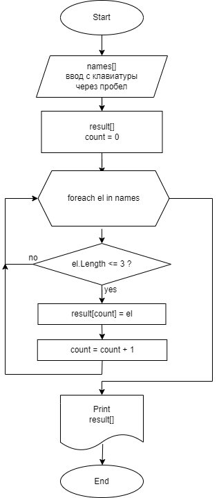

# Задача.
Написать программу, которая из имеющегося масcива строк формирует массив из строк, длина которых меньше либо равна 3 символам.

Первоначальный массив можно ввести с клавиатуры, либо задать на старте выполнения алгоритма.

При решении **не рекомендуется** пользоваться коллекциями, лучше обойтись исключительно массивами.

# Описание решения

1. Вводим с клавиатуры исходный массив строк _**names[ ]**_ через пробел
2. Объявляем новый массив _**result[ ]**_ и вводим счетчик _**count=0**_
3. Проверяем каждый элемент исходного массива на соответствие условию (длина элемент <= 3)
4. Если условие (строка 3) выполняется, тогда записываем в новый массив _**result[count]**_ этот элемент и увеличиваем на 1 счетчик _**count++**_
5. Получаем новый массив, элементы которого соответствуют условию (строка 3) и выводим его на печать.

# Графическое решение
